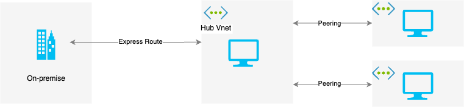
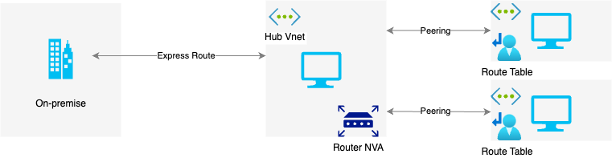
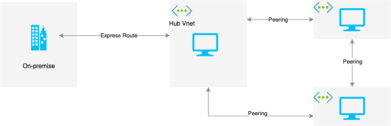
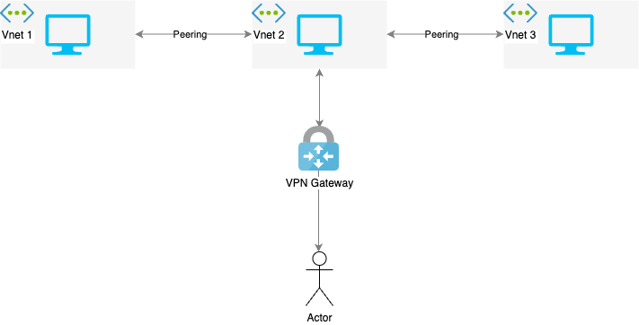

  

# Azure Vnet Peering and VPN Gateway

## Introduction

In today's 100DaysofCloud challenge, we will be introduced to Vnet Peering and VPN Gateways in Azure Networking. Azure Networking is an essential and sought-after skill for any cloud platform engineers. Vnet Peering enables the connection of two virtual networks, while VPN Gateways provide a secure connection between an on-premises network and a virtual network in Azure. Understanding these concepts and their use cases are foundational to building a hybrid network that connects on-premises networks and virtual networks in Azure. We can start by learning about Virtual Networks (VNets), Subnets, Network Security Groups (NSGs), and Azure Firewall before moving on to more advanced topics.

## Notes and Reflection:

### Understanding Vnet Peering:
#### Virtual Networks
Virtual Network can communicate with things inside of the virtual network such as the internet but unable to communicate with other virtual networks from other subscriptions or in the same subscription. 

#### Vnet Peering
The solution is to create a Vnet Peering. This allow us establish low latency and high bandwidth connectivity between virtual network over the Micrsoft backbone. 

This will avoid the public internet which is more secure. 

Some benefit from Vnet Peering includes:
* Provides low latency and high bandwidth over private IP using Microsoft backbone 
* Support cross-subscription connectivity 
* Support cross-region connectivity

Some limitation from Vnet Peering includes:
* Address spaces cannot overlap
* Does not support transitive routing by default. 

The above image describe a network traffic between three vnet. In Azure, peer-to-peer transitive routing describe network traffic between two virtual network that are routed through an intermediate virtual network with a router. 

The above image describe three simple virtual network. 
- Vnet 1 has peered with Vnet 2 
- Vnet 2 has peered with Vnet 3 

However, Vnet 1 is unable to talk to Vnet 3 as they are not connected and have to go through Vnet 2 which describes transitive routing. 

The most common networking architecture is a "hub and spoke" topology. This contains a central "hub" connected to an on-premises network via ExpressRoute circuit. Additional "spoke" vnet that support specific workloads are connected to 5the hub. 

The diagram above have a problem which does not support communication between the "spoke". An organisation might want to host an application server in a "Spoke1" virtual network and a central database server in a "Spoke2" virtual network. 

#### Solution 1: 

A quick solution would be to create a vnet peering between the two "Spoke". 

However, this might be an issue as you may run out of peering connection due to the limitation of number of virtual networking peerings per virtual network. 

#### Solution 2: 

Another solution would be using UDR or a User-Define Route to force "Spoke" to be sent to Azure Firewall or a Network Virtaul Appliance (NVA) acting as a router at the hub. This will allow spokes to connect to each other. 

Note: Address spaces of the vnet must be different or else Vnet Peering is not possible. 

#### Solution 3: VPN Gateway
You can also use VPN Gateway to establish connectivity within Vnets

* VPN Gateway is made up of a special subnet called GatewaySubnet inside each Vnet
* It uses a public IP address for each VPN gateway to establish connectivity versus VPN Peer that uses private IP
* Utilise IPSec site-to-site VPN tunnel that encrypts all connectivity going through the gateway
This ensures that the data is still secure even if someone has manage to penetrate the VPN tunnel. 

## Prerequisite

1) Understanding of Vnet Peering and VPN Gateway theory
2) Understand transitive routing and how it is used in organizations
3) Azure Subscription + Azure Resource Group 
4) 3 Vnet with unique IP subnets (preferably same region) [link](https://learn.microsoft.com/en-us/azure/virtual-network/quick-create-portal)
5) Azure VPN Gateway deployed in the HUB Virtual Network [link](https://learn.microsoft.com/en-us/azure/vpn-gateway/tutorial-create-gateway-portal#VNetGateway)
6) Virtual Network Peering between spokes network to the hub [link](https://learn.microsoft.com/en-us/azure/vpn-gateway/vpn-gateway-peering-gateway-transit#same)
7) VM in each spokes

## Lab 1

1) Create two Vnet in the same location - you can call them Vnet1 and Vnet2.
2) Create an Ubuntu VM in each Vnet.  
3) Try to connect to the VM in Vnet1 and try to ping Vnet2
4) Create a Vnet Peering between Vnet1 and Vnet2.
5) Try to ping them again. 

## Lab 2

1) Within the Vnet Peering and navigate to the advance settings
2) Turn on Allow for Trafic forwarded from remote virtual network - This allows the peering relationship to talk between spoke and hub
3) Use this virtual network gateway or Route Server under Virtual Network gateway or Route Server - This will allow peering connection from the hub to the spokes must allow forwarded traffic and gateway transit
4) Copy and note down each IP address space for each spoke Vnet. We will be using it to configure User-Defined Routes (UDR)
5) In the Azure Portal, search for "Route Tables" and then click on "+Add" 
6) Ensure that the Propagate gateway routes is selected as "No" this is to prevent the propagation of on-premises routes to the network interfaces in associated subnet. 
7) Once the route table is created, you can add the routes by clicking on "Routes" under the "Settings" section and "+Add" 
8) We can create only one route as traffic from Network "Spoke1" Vnet wants to talk to "Spoke2" Vnet through the Azure VPN Gateway in the Hub Virtual Network
9) Provide the route name, Ip address prefixes that you have noted down for "Spoke2" and ensure that the next hop type is selected as Virtual network gateway. - The next hope handles matching packets for this route. It can be the Vnet / Vnet gateway / Internet 
10) Assign the route table to the default subnet of "Spoke1" virtual network. You can assign the subnet by clicking on "Subnet" under the "Settings" section of the "Route Table" and then click on "+ Associate" 
11) Repeat the same steps describe above for "Spoke2" virtual network as well. 

## Cloud Research

Vnet Peering: Designed for Vnet to Vnet connectivity used for low latency connectivity
VPN Gateway: Designed for hybrid connectivity generally used for transitive routing / encryption 

