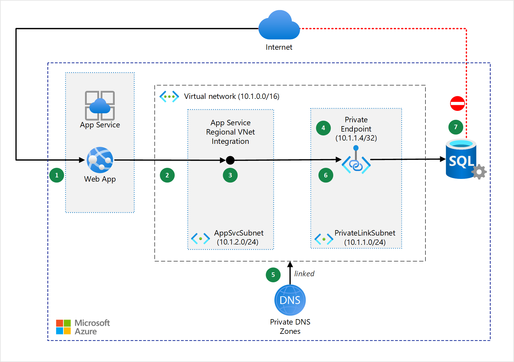

# Understanding App Service Plan and Virtual Network Integration

## Introduction

We have touched on Azure Vnet, Vnet Peering and VPN Gateway. I thought it should be about time we jump into using private endpoints, web app in Azure App Services and Azure SQL Database. 

I will try to summarise and pick out some information that I think is important to create this. You can find the documentation more here [link](https://learn.microsoft.com/en-us/azure/virtual-network/quick-create-portal)

The aim of this exercise is the following:
* Deploy all resources using Terraform as my preferred IaC tool. If you are following my 100 Days of Azure, feel free to use BICEP or ARM Templates instead. 
* Understanding Azure App Service & Virtual Network Integration

## Prerequisite

1) WebApp receives a HTTP request from the internet that requires an API call to the SQL Database

2) WebApp hosted in App Service can only be reached by internet-hosted endpoints.
* Communicate with resources in virtual network that aren't internet facing
* Enable regional virtual network integration - web app access to resources in the virtual network that aren't internet-hosted endpoint. 

3) The web app connect to the virtual network through a virtual interface mounted in the AppSvcSubnet of the Vnet

4) Azure Private Link sets up a private endpoint for the Azure SQL Database in the PrivateLinkSubnet of the virtual network. 

5) The Web App connects to the Azure SQL Database through the private endpoint in the PrivateLinkSubnet

6) The Azure SQL Database firewall allows only traffic coming from the PrivateLinkSubnet to connect. The database should be inaccessible from the public internet. 

## Components / Resources
Azure App Service - hosts web applications, allowing autoscale and high availability without having to manage infrastructure.

Azure SQL Database - a general-purpose relational database managed service that supports relational data, spatial data, JSON, and XML.

Azure Virtual Network - the fundamental building block for private networks in Azure. Azure resources like virtual machines (VMs) can securely communicate with each other, the internet, and on-premises networks through Virtual Networks.

Azure Private Link - a private endpoint in a Virtual Network for connectivity to Azure PaaS services like Azure Storage and SQL Database, or to customer or partner services.

Azure DNS - hosts private DNS zones that provide a reliable, secure DNS service to manage and resolve domain names in a virtual network without the need to add a custom DNS solution.

## Use Case

* Private connectivity from an Azure App Service to Azure PaaS
* Private connectivity from an Azure App Service to Azure PaaS service that aren't natively deployed to isolated Azure Virtual Network
* Connect from Azure App Service to Azure Storage, Azure Cosmos DB, Azure Function App that supports an Azure Private Endpoint for inbound connectivity.

## Try yourself

1) Deploy the above architecture using infrastructure as code specifically Terraform.

2) Emphasis on the definition of a virtual network using an address range and creation of subnet within it:

* privatelinksubnet - private endpoint that expose the private endpoint of the database
* appsvcsubnet - web app's regional virtual network integration

3) Create the private endpoint in the privatelinksubnet

4) Integrate with private DNS One option - This will register the private IP addres of the database server in the privatelink.database.windows.net private Azure DNS Zone.

5) Enable Vnet Integration - Add Vnet - AppSvcSubnet
* This 
### Step 1 — Summary of Step

### Step 1 — Summary of Step

### Step 3 — Summary of Step

## ☁️ Cloud Outcome

✍️ (Result) Describe your personal outcome, and lessons learned.

## Next Steps

✍️ Describe what you think you think you want to do next.

## Social Proof

✍️ Show that you shared your process on Twitter or LinkedIn

[link](link)
