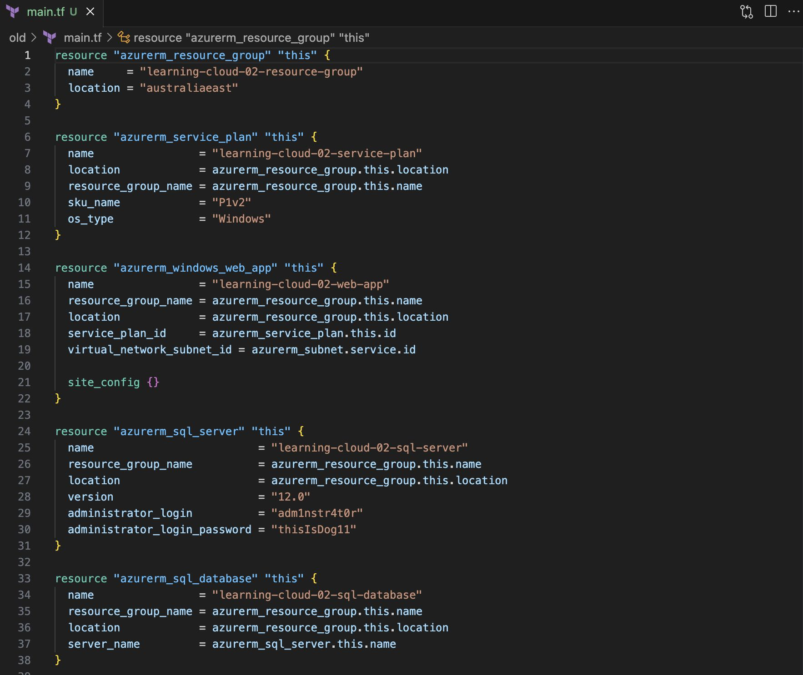
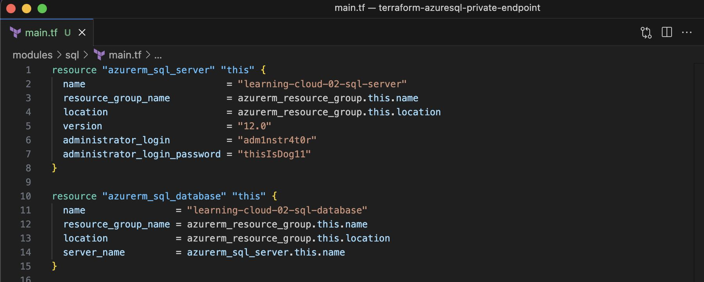
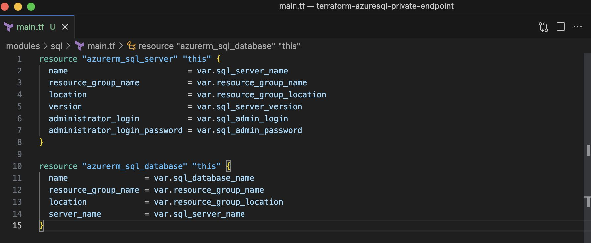
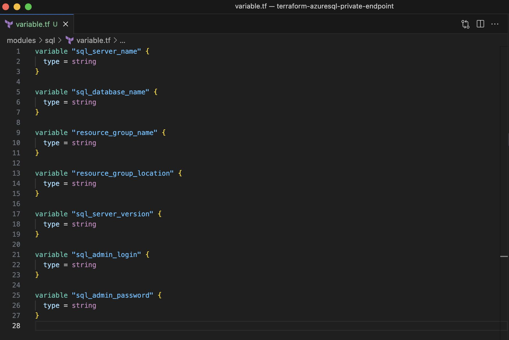

# What is a Terraform Module?

## Introduction

Modules allow you to organise your configuration by grouping and seperating components such as Networking. This will allow us to have a re-usable configration that we do not need to write repetable code from scratch and prevent unintended / accidental changes. 

Overall, modules provide a consistent structure and making it easy to understand, reusable and allow us to scale out in the future without worrying about accidental changes. 

## Standard Structure Example: 
    .
    ├── main.tf                 # main set of configuration for your module
    ├── variables.tf            # variables definition for your module. This will allow us to declare any predefined variables or any arguments / restrictions on variables.
    ├── output.tf               # output file for your module, pass information to other parts of your infrastrucutre

## Module Structure Example: 
    .
    ├── main.tf                 
    ├── variables.tf            
    ├── output.tf               
    ├── modules                 # module folder
    │   ├── networking              # child module 
        │   ├── main.tf              
        │   ├── variable.tf             

## Cloud Research

In the module structure above, we have move any static values and convert them into variables which can be fed using tfvar files. The deployment code can call the child module in our case it is the networking folder which will declare the required variables. 

## Try yourself

I've created a terraform-azuresql-private-endpoint repo a while back which essentially uses the standard structure of terraform. I will use that same repo and update it with the module structure which I have explained above. 

Please take a look at my repo [here](https://github.com/Colinloh248/terraform-azuresql-private-endpoint?search=1) which would be my first take on creating my first ever module.

### Step 1 — Create Module Directory

The screenshot above shows the standard structure of terraform:
* main.tf: This file contains the main configuration of your infrastructure resources, including the definition of providers, resources, variables, and other settings.
* provider.tf: This file is used to define and configure the providers you intend to use in your infrastructure code. Providers are responsible for interacting with various cloud platforms or services to provision and manage resources.
* version.tf: This file specifiy the required version constraint for terraform and the plugin. This ensure that anyone who runs your infrastructure code uses the specified versions of Terraform and provider plugins, which helps maintain consistency and avoids compatibility issues.

Now that we know the basics structure and a good understanding of the configuration files that we have in the standard structure, lets try to organize it into modular units.

    .
    ├── main.tf                 
    ├── variables.tf            
    ├── output.tf               
    ├── modules                 # module folder
    │   ├── network             # child module 
    │   ├── sql              
    │   ├── app  
        
In my particular project I have identified 3 different infrastructure components that can be encapsulated into reusable modules. A logical groupings of resources can be defined as networking, storage and application.

### Step 2 — Move Resources

Lets quickly create a module directory for each module. I have created a root folder called modules and under our root folder we have our child modules which I called them app, network and sql respectively.

Each child module will contain the following structure:
    app / network / sql
    ├── main.tf                 # main set of configuration for your module
    ├── variables.tf            # define the required input variables.
    ├── output.tf               # define the outputs you want to expose.

I would then move each one of the groupped resources from the main.tf that we initially have in our standard structure into their respective child modules. An example of this would be my sql child module would only contain azurerm_sql_server and azure_sql_database and nothing more. It does not make much sense to have our sql child module grouped with web app or a service plan. 

### Step 3 — Define Module Input and Output

Once we have decided to have our sql resources in our sql child module, it is time to identify the input variables needed for the module. 

Within each module directory, we have a variable.tf which is to define the required input variables and parameterize the modules to make them customizable.

In our case, we would make everything in azurerm_sql_server and azurerm_sql_database as a variable. This will allow us to reuse and reference the module in our main configuration.

When we finished declaring our variables that we need for our sql. 

You can also create an ouput.tf if there are other resources outside of your child module require access to the resources. An example would be our web app need to consume our sql server id:

### Step 4 — Define Module Input and Output

In the main configuration files (e.g., main.tf), replace the moved resource definitions with module invocations. Update the module invocations with the necessary arguments for the input variables. By referencing the module, we need to also provide the source on where our module directory is saved. 

Within our module block, we would also need to fill in the variables that we would want to feed into the module. This would usually be the same as what we have declared from our variable.tf in step 3 for our child module.

## Step 5 - Test and Validate

terraform init and terraform plan to validate the changes and ensure the project still works as expected. Make any necessary adjustments or fixes to address any errors or issues.

