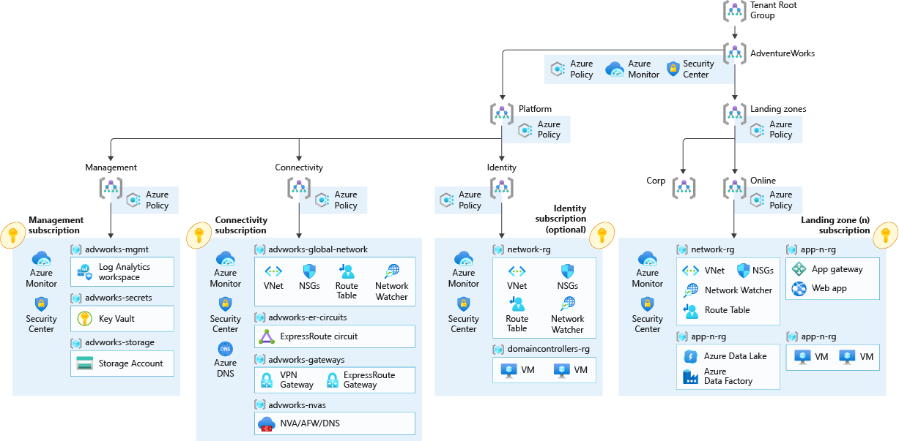

# Azure Landing Zone (ALZ)

## Introduction

Starting out my career as a Platform Engineer, I was put onto a project that required me to develop an Azure Landing Zone.
This made me realize how important it is for any organization to know what an Azure Landing Zone is and how it can help them.

A quick explanation of Azure Landing Zone:
* Landing Zone is an environment to host your workload that is pre-provisioned through Infrastructure as Code (Terraform).
* Uses a pre-defined cloud services to add capabilities such as Networking / Identity Management / Governance / Security / Management (see 5 key principles below).
* Provide a stable place for application and workflow to run and scale.

5 Key Principles for ALZ: 
* Networking services > Azure Express Route
* Set identity management rule > Azure Active Directory
* Governance environment > Azure Policy
* Security control > Azure Sentinel
* Manage environment > Azure Monitor 

## Customer Profile

The customer requested a hybrid connectivity to on-premises location. Azure Landing Zone can support enterprise application portloios and add hybrid connecitivty with ExpressRoute or VPN when required.

A hub and spoke network topology allows you to create a central Hub Vnet that contains shared networking components. 
This includes: 
* ExpressRoute
* VPN Gateway
* Firewall 

The Hub Vnet can later be used by the spoke Vnet via Vnet Peering to centralize connectivity in you environment. 

* Gateway transit in Vnet peering allows spokes to have connecivity to/from on-premises via ExpressRoute or VPN
* Transitive connectivity across spokes can be implemented by deploying User Defined Routes (UDR) on the spokes and using Azure Firewall or an NVA in the hub.

## Use Case

If the customer decide to migrate on-premise application to Azure that require hybrid connectivity, you would simply need to create
the Connectivity Subscription and place it into the Platform > Connectivity Management Group as shown below.

Other additional things that will be deployed are the following:
* A scalable Management Group hierarchy aligned to core platform capabilities using managed Azure RBAC and Azure Policy.
* Azure Policies that enable automomy for the platform and landing zone such as enforcing resource types, naming, properties for security and compliance.
* Integrate Azure Environment with Azure DevOps by providing PA Token to create new repository
* Azure Subscription specifically dedicated for connectivity. 
* Landing Zone subscription for connected application and resources including a virtual network that will be connected to the hub via Vnet Peering.

## Cloud Research

### Deploy Management Groups
There should be a default management group resource hierarchy including additional Management Groups for demonstrating custom 

Subscription is a container of resources that contain the follow:
* Azure Policy
* Role Based Access Control
* Budget - Billing mecahnism within organization

Some enterprise may have alot more subscriptions, we do not want to apply *policies* and *rbac* and *budgets* to all of those subscription individually.

Solution?
*Management Group*

Under a management group we can have different business units / production and apply all policies, rbac and budgets and get *inherited* down to the subscriptions below.

### Why use infrastructure as code? 
We can definitely do ClickOps and deploy resources, management group, subscriptions, policies and etc.. via the Azure Portal. However, this would not be the best way. 
Why?
* You are not creating in a consistent manner
* Not repeatable and unable to track for drift

Solution? 
*Infrastrucure as Code* 

* Readable code
* *DECLARATIVE* - it tells Azure Portal what we want to be there 
* *IDEMPOTENT* - rerun the code anytime we want, it will modify or create the resource that we expect to be there

### Key resources in any Azure Landing Zone
* Log Analytics Workspace
* Azure Security Center 
* Virtual Network in each subscription - Spoke
* Virtual WAN (Router) or Express Route Gateway / Site - Site VPN to governance overall set of networking for the company - HUB
* Azure Key Vault in each subscription 

### Azure Blueprint

Azure Blueprint provides a declarative way to define and manage collections of Azure resources, including policies, role assignments, resource groups, and Azure Resource Manager templates. 
This allows organizations to create consistent and repeatable environments that meet their compliance and security requirements.

The blueprint can be assigned to any subscription that stamp down that configuration to the particular subscription. 
* Assignment of the blueprint - lock (you can lock - prevent additional subnet to deploy (example) / delete - prevent delete of resources )

Alternatively we can use terraform modules if your organization has multi-cloud configuration or has a preference.
 
### Azure AD Instance 
* Users 
* Service Principles
* Guests 

We can add all of these into groups (identity object) 

## Try yourself

Create a blueprint 
* Create a resource group for Shared Services
* Deploy keyvault
* Deploy log analytics

